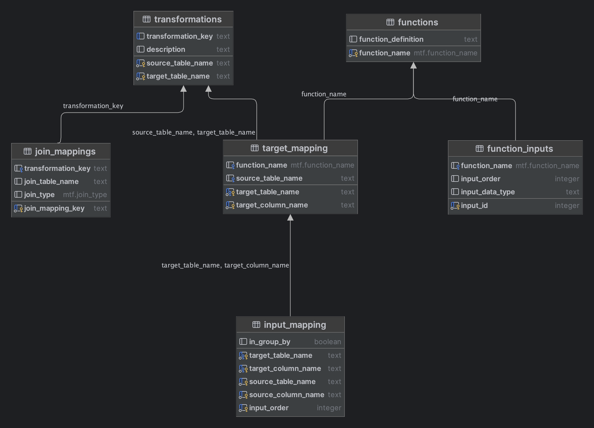

<div align="center">
  <picture>
    
  </picture>
</div>

# MTF - Metadata-Driven Transformation Framework 
A Postgres program that enables users to create transformation logic using a data driven approach.

## TL;DR
Don't use code for your transformations. Use data.

## Introduction
Want to use a data driven approach to creating your transformation logic? This framework is for you.

### Problem it is trying to solve
- Have multiple inputs that are of a similar nature, but have different column names or have some level of complexity.
- Allowing for a SQL Code first approach to generating transformation logic, and allowing for the leveraging of information schema. 


## How to use 
> Ensure you understand the basic concepts of the framework before using it. See Transformation Core Concepts below.


1. Create the mapping tables 
    - src/mappings/01_DEFINE_MAPPINGS.sql
2. Create Functions
    - src/functions/* 
3. Create the Function Mappings & Enums 
    - src/functions/03_DEFINE_FUNCTION_MAPPINGS.sql
4. Create the Transformation 
    - src/procs/04_DEFINE_PROCS.sql
5. Use the examples 

## Transformation Core Concepts  

### Diagram 


### Transformations 
This entity represents a transformation that is applied to a table. 
Consider this the table you ```INSERT INTO```

### Target Mapping 
This represents an output column, of which there can be many inputs to. A target mapping can have a function applied to it to transform the data.
Consider this the column you ```INSERT INTO```

### Function
The definition of a function that can be applied to a target mapping.
Consider this the function you apply to a column in a ```SELECT``` statement.

### Function Input 
The definitions of the inputs which can be inserted into a function.
Consider this the parameters you pass to a function in a ```SELECT``` statement.


### Join Mappings 
The definitions of tables to join to when performing a transformation.
Consider this the tables you ```JOIN``` to in a ```SELECT``` statement.

## Todo: 
- Build Auto Install script 